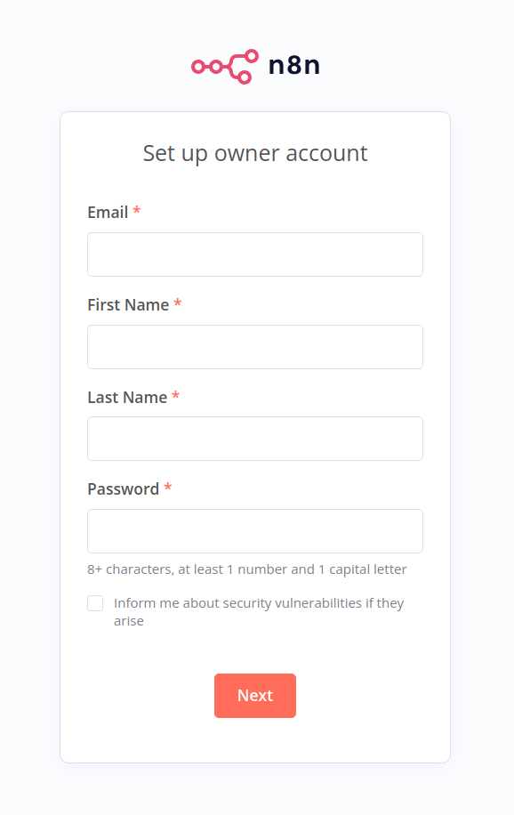

# n8n-free-setup

A cost-effective and secure solution for deploying **n8n** on an HTTPS-enabled server using **AWS EC2** and **duckDNS**, ensuring seamless automation workflows without additional hosting expenses.

## About The Project

This project demonstrates how to set up and run **n8n**, an automation and workflow tool, on a free-tier AWS EC2 instance secured with HTTPS. We use **duckDNS** to provide a free subdomain, ensuring HTTPS access and compliance with services like the Telegram API, which requires communication over port 443 via HTTPS.

### Why AWS?
- AWS offers a free tier that allows you to run small instances at no cost.
- Easy setup of security groups and instance management.

### Why duckDNS?
- **duckDNS** provides free domain/subdomain services.
- Straightforward configuration to point your public IP to a custom subdomain.

## Built With

- 
- 
- 
- 

## Getting Started

### Prerequisites

1. **AWS Account**: Make sure you have an AWS account with access to create EC2 instances.
2. **Docker**: Knowledge of Docker and docker-compose is helpful (the installation steps will be outlined below).
3. **duckDNS Account**: To create a subdomain for free HTTPS access.

## Setup

Below is the step-by-step guide to configure everything from server creation to domain setup.

---

### Step 1: AWS EC2 Setup and n8n Installation

1. **Create a Security Group** in AWS:
   - Go to **Security Groups** in the AWS console.
   - Create a new group that allows inbound traffic on **port 443** (HTTPS).

2. **Launch an EC2 Instance**:
   - Navigate to **EC2** > **Instances** > **Launch Instances**.
   - Select a suitable Amazon Machine Image (e.g., Amazon Linux 2).
   - Attach the newly created security group (which allows port 443).
   - In the **User data** section (under Advanced details), insert your Docker installation script or use the content from `scripts/server_ec2_user_setup.sh`.

3. **Connect to Your EC2 Instance**:
   - Navigate to **EC2** > **Instances** > **Click over your created Instace** > **Connect**
   - Once connected, switch to the `ec2-user` if needed: `sudo su ec2-user`.

4. **Project Folder Setup**:
   - Navigate to the home directory: `cd /home/ec2-user`.
   - Create a folder for n8n: `mkdir n8n`.
   - Enter the folder: `cd n8n`.

5. **Create .env and docker-compose.yml**:
   - Inside the `/home/ec2-user/n8n` folder, create two files: `.env` and `docker-compose.yml`.
   - Copy the contents from your repository.
   - Make sure to edit the `.env` file with your domain or subdomain details (as configured with duckDNS).

6. **Run Docker Compose**:
   - Start the container: `docker-compose up -d`.
   - This command pulls the n8n Docker image and runs it in detached mode with HTTPS enabled on port 443.

*Note:* You do not need a Route 53 subdomain redirection because **duckDNS** will handle the DNS pointing to your EC2 public IP.

**Official n8n Documentation** for server setup with Docker: [https://docs.n8n.io/hosting/installation/server-setups/docker-compose/](https://docs.n8n.io/hosting/installation/server-setups/docker-compose/)

---

### Step 2: Subdomain Setup with duckDNS

1. **Create a duckDNS Account**:
   - Go to [duckdns.org](https://www.duckdns.org/domains).
   - Sign in or register to start managing your subdomains.

2. **Choose a Subdomain**:
   - Pick a name for your subdomain, for example, `n8n`.
   - The full domain will look like: `n8n.duckdns.org`.

3. **Point the Subdomain to Your EC2 Public IP**:
   - Insert your **EC2 public IP** (found on the AWS instance console or via `curl ifconfig.me`) in duckDNS’s settings.
   - Verify that `n8n.duckdns.org` points to your server’s IP.

4. **Update .env File**:
   - In your `.env` file on the server, make sure you have:
     ```dotenv
     DOMAIN_NAME=duckdns.org
     SUBDOMAIN=n8n
     ```
   - Adjust these variables to match the subdomain you created.

---

## Application Operation

After completing the setup steps above, your n8n instance should be running and accessible over HTTPS. Here is how to confirm and use it:

1. **Check Docker Containers**:
   - On your EC2 instance, run `docker ps` to ensure the n8n container is up and running.

2. **Access the n8n Web Interface**:
   - Open your browser and visit `https://n8n.duckdns.org` (replace with your actual subdomain).
   - You should see the n8n login page or setup wizard (depending on your configuration).

3. **Build and Manage Workflows**:
   - Once you’re logged in, you can create workflows that integrate with various APIs.

Set up owner account screen:
<div align="center">
  
</div>

---

## Acknowledgments and References

- Special credit to **[henrylle](https://github.com/henrylle)** for the tutorial on installing n8n via Docker on AWS EC2.  
  Video tutorial: [https://www.youtube.com/watch?v=-gyIdyy3X0Y](https://www.youtube.com/watch?v=-gyIdyy3X0Y)
- Official **n8n** Documentation: [https://docs.n8n.io](https://docs.n8n.io)
- **duckDNS** Documentation: [https://www.duckdns.org/domains](https://www.duckdns.org/domains)

Feel free to contribute, suggest improvements, or raise issues in this repository. Happy automating!
